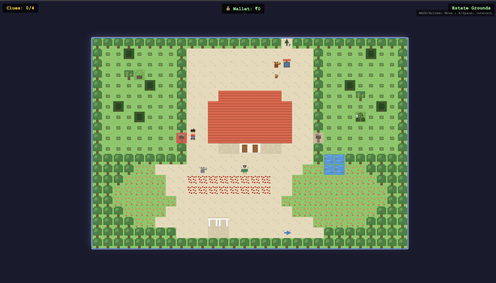

# Bloom

*A coffee estate simulation set in the misty hills of Coorg, India.*

> In the Western Ghats, where mist clings to the hills and coffee blossoms paint the slopes white, you inherit an estate. Bloom is a meditation on seasons, soil, and the slow magic of cultivation.

Grow, harvest, and process coffee through the seasons — from seedling to cup.

## Features

### Coffee Cultivation
- **Two Coffee Varieties**: Grow both Arabica and Robusta
- **Realistic Growth Cycle**: From seedling to mature plant to harvest
- **Six Seasons**: Experience the authentic Coorg agricultural calendar
  - Post-Harvest (Jan-Feb)
  - Blossom (Mar-Apr)
  - Planting (May)
  - Monsoon (Jun-Sep)
  - Ripening (Oct-Nov)
  - Harvest (Nov-Feb)

### Estate Management
- **Resource Management**: Balance money, water, and power
- **Labor System**: Hire workers (pickers, processors, maintenance)
- **Market Dynamics**: Coffee prices fluctuate by season and demand
- **Random Events**: Weather, pests, festivals, and more

### Mini-Games
- **Cherry Picking**: Click ripe cherries before time runs out
- **Bean Sorting**: Grade beans into MNEB, A, B, C quality
- **Processing**: Manage pulping, fermentation, and drying

### Visual Features
- **2.5D Graphics**: Parallax backgrounds, dynamic shadows
- **Weather Effects**: Rain, mist, sun rays, falling leaves
- **Seasonal Themes**: Visual changes throughout the year
- **Achievement System**: 12 achievements to unlock

### Mobile Support
- Touch controls with virtual D-pad
- Responsive layout for phones and tablets
- Mini-games work with tap controls

## How to Play

1. Open `index.html` in a modern browser
2. Create your character
3. Start managing the plantation!

### Controls

| Key | Action |
|-----|--------|
| `WASD` / `Arrow Keys` | Move |
| `E` / `Space` | Interact |
| `Enter` | Confirm |

### Tips

- Check the **Dashboard** regularly to monitor your plants and resources
- Hire workers during harvest season - labor is scarce!
- **Fermentation timing** is crucial: 36-48 hours is optimal
- Watch the **market prices** - sell when demand is high
- Keep your plants **watered** during dry seasons

## Coffee Grading System

| Grade | Description |
|-------|-------------|
| MNEB | Mysore Nuggets Extra Bold - Premium export quality |
| Grade A | High quality, minimal defects |
| Grade B | Good quality, some defects |
| Grade C | Standard quality |

## Technical Details

- Pure HTML5 Canvas - no frameworks
- Procedural audio with Web Audio API
- Runs entirely in the browser
- Mobile-responsive design

## Browser Support

- Chrome (recommended)
- Firefox
- Safari
- Edge

## About Coorg

Coorg (Kodagu) is a hill district in Karnataka, India, known as the "Scotland of India." It's one of India's largest coffee-producing regions, famous for:
- Misty hills and lush forests
- Traditional Kodava culture
- High-quality Arabica and Robusta coffee
- Cardamom and pepper cultivation

## License

MIT License - feel free to use, modify, and share!

---

*An educational coffee plantation simulation*
